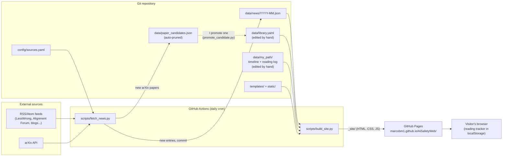

# How This Site Works

> These are my notes on the **current** state of the project. I update them in
> the same commit as every change. Sections marked **🚧 Not built yet** describe
> the design I agreed on for a future stage.
>
> I wrote them for someone with a technical background (my own is security
> operations) who is new to web development. Unfamiliar terms are defined in the
> [Glossary](#glossary).

**Current status:** Stage 2 of 8 complete (news fetching, paper candidates and data formats). The plan for the remaining stages is in [docs/DEVLOG.md](DEVLOG.md).

## Contents
1. [What this project is](#1-what-this-project-is)
2. [Architecture](#2-architecture)
3. [Folders and files](#3-folders-and-files)
4. [Setting up a computer](#4-setting-up-a-computer)
5. [The fetch script, step by step](#5-the-fetch-script-step-by-step)
6. [Building and previewing the site locally](#6-building-and-previewing-the-site-locally)
7. [GitHub Actions and the cron schedule](#7-github-actions-and-the-cron-schedule)
8. [Deployment to GitHub Pages and the base path](#8-deployment-to-github-pages-and-the-base-path)
9. [How to…](#9-how-to)
10. [Working from two computers](#10-working-from-two-computers)
11. [Common problems and fixes](#11-common-problems-and-fixes)
12. [Glossary](#glossary)

---

## 1. What this project is

I built a **static website** about AI Safety, hosted for free on **GitHub Pages**
at https://marcobm1.github.io/AiSafetyWeb/. It has:

| Section | What it shows | Where the data comes from |
|---|---|---|
| **Today in AI Safety** (home) | Entries from the last 24–48 h, grouped by topic/source | Collected automatically every day |
| **News archive** | All earlier entries, browsable by date, filterable by source/topic | Same automatic collection |
| **Library** | My curated archive of papers, essays, reports, scenarios and blog posts, filterable by type/year/tag/difficulty | `data/library.yaml`, which I edit by hand |
| **Start Here** 🚧 | An ordered reading path for newcomers to AI Safety, in stages, each entry with a note on why it sits at that point | Also `data/library.yaml`: the stage list plus a `start_here` block on each entry in the path |
| **My Own Path** 🚧 | My public learning log in two parts: a **Timeline** of courses, projects and milestones (vertical, clickable, with duration bars) and a **Reading log** of everything I read, grouped by month, with type filters and a readings-per-month chart | `data/my_path/timeline.yaml` and `data/my_path/reading_log.yaml`, which I edit by hand |
| **Reading tracker** | Each visitor marks entries as *read* / *to read* (in the Library **and** in Start Here) | The visitor's own browser (localStorage) |
| **About** | What the site is, sources, how updates work | Template text |

**Reading tracker vs My Own Path:** the tracker is private to each visitor's
browser and nobody else sees it. My Own Path is my own *public* record, written
by me in a file in the repository.

My content rules: the site only shows the **title, source, date, a short excerpt
(max ~2 sentences) and a link** to each original. I never republish full
articles. Each entry has an empty `summary` field that I'm reserving for future
AI summaries.

## 2. Architecture

There is **no server and no database**. Everything is files in the Git repository.
A robot (GitHub Actions) runs once a day, adds new data, rebuilds the HTML and
publishes it.



**Why I chose Python + Jinja2 instead of a site generator like Astro or Eleventy:**
the fetch script has to be Python anyway. Writing the page generator in Python
too means I only deal with one language and toolchain (no Node.js/npm), and
Python is also the language I use for ML. The generated HTML is complete on its
own, so the site works without JavaScript. JavaScript only adds filters, the
dark-mode toggle and the reading tracker.

## 3. Folders and files

| Path | Purpose | Status |
|---|---|---|
| `CLAUDE.md` | Permanent rules for Claude sessions working on this repo | ✅ |
| `README.md` | Short intro and quick start | ✅ |
| `requirements.txt` | Python dependencies with **pinned** (exact) versions | ✅ |
| `.python-version` | The Python version (3.12). GitHub Actions reads this file too | ✅ |
| `.gitignore` | Files Git must ignore (`.venv/`, `_site/`, caches) | ✅ |
| `.gitattributes` | Forces LF line endings in the repo (avoids Windows/Linux diffs) | ✅ |
| `docs/HOW_THIS_SITE_WORKS.md` | These notes | ✅ |
| `docs/DEVLOG.md` | My chronological log of every change and why | ✅ |
| `config/sources.yaml` | All news sources, arXiv query, karma thresholds, topic keywords | ✅ |
| `config/site.yaml` | Site title, base path, retention settings | 🚧 Stage 3 |
| `scripts/fetch_news.py` | Downloads feeds + arXiv, deduplicates, saves JSON and paper candidates | ✅ |
| `data/news/YYYY-MM.json` | Collected news, one file per month | ✅ |
| `data/status.json` | Time of last run + status of each source | ✅ |
| `data/paper_candidates.json` | New arXiv papers I might add to the archive. Written by the bot, old ones pruned automatically | ✅ |
| `data/library.yaml` (format only) | Empty file with the documented format, so the fetch script can skip papers I already curated | ✅ |
| `data/my_path/timeline.yaml` | My Own Path timeline (my first two courses) | ✅ data, 🚧 page in Stage 5 |
| `data/my_path/reading_log.yaml` | My Own Path reading log (empty, format in comments) | ✅ data, 🚧 page in Stage 5 |
| `scripts/promote_candidate.py` | Copies a candidate into `library.yaml` as a new block | 🚧 Stage 4 |
| `scripts/build_site.py` | Turns templates + data into the `_site/` folder | 🚧 Stage 3 |
| `templates/` | Jinja2 HTML templates | 🚧 Stage 3 |
| `static/` | CSS and JavaScript | 🚧 Stages 3–6 |
| `data/library.yaml` (content) | Curated reading archive, Start Here stages and entries | 🚧 Stages 4–5 |
| `.github/workflows/update-and-deploy.yml` | Daily automation | 🚧 Stage 7 |
| `_site/` | Generated website. **Not committed**, rebuilt each time | 🚧 Stage 3 |
| `.venv/` | Python virtual environment. **Not committed**, one per computer | ✅ (local) |

**Why one JSON file per month:** the files stay small, the daily Git diffs stay
readable, and merge conflicts are rare because only the current month's file changes.

**YAML for what I edit, JSON for what the bot writes:** YAML is easier for me
to read and edit by hand, and it allows comments. JSON is strict, which is
safer for files that a script rewrites every day.

### 3.1 Data formats

I fixed these formats in Stage 2, even though the Library, Start Here and My
Own Path pages come later, so every script and page is built against the same shape.

**The `id` is the glue.** Every reading entry in `library.yaml` has a stable,
unique `id` (a short lowercase slug such as `ai-2027` or `sleeper-agents`).
The Library, the Start Here path, the My Own Path reading log and the visitors' reading tracker
all refer to an entry by this `id`, so its data (title, authors, URL) lives in
one place only. **I never change an `id` once it's published**, because
visitors' saved *read / to read* marks point to it.

#### `data/library.yaml` — my curated reading archive (edited by hand)

The file has two top-level keys. `start_here_stages` lists the stages of the
Start Here path, in the order they appear on the site. `entries` holds every
reading. **`entries` must stay the last key in the file**, because
`promote_candidate.py` appends new entries to the end of the file.

```yaml
start_here_stages:                     # order in this list = order on the site
  - id: why-it-matters                 # referenced by start_here.stage below
    title: Why it matters
    intro: >
      Short paragraph shown at the top of the stage.

entries:
  - id: sleeper-agents                 # stable slug, unique, never changes
    title: "Sleeper Agents: Training Deceptive LLMs that Persist Through Safety Training"
    authors: ["Evan Hubinger", "et al."] # "et al." allowed for long author lists
    year: 2024
    type: paper                        # paper | essay | report | scenario | blog-post
    url: https://arxiv.org/abs/2401.05566
    arxiv_id: "2401.05566"             # optional; lets the fetch script skip it as a candidate
    tags: [alignment, evaluations]
    difficulty: intermediate           # intro | intermediate | advanced
    why_it_matters: >
      One or two sentences, in my words, on why this entry is in the Library.
    added: 2026-09-23                  # date I added it
    start_here:                        # optional: only if it's part of the Start Here path
      stage: evaluations               # an id from start_here_stages
      order: 2                         # position inside that stage
      note: >
        Why it sits at this point of the path.
```

The website shows `type` as a label (e.g. *Scenario*, *Blog post*) and lets
visitors filter by it.

**Why Start Here has no file of its own:** a reading joins the path through its
own `start_here` block, so its data exists only once and the path can never
point to an entry that isn't in the Library. The build script groups the
entries by `start_here.stage` and sorts them by `start_here.order`; the stage
titles and intros come from `start_here_stages`. The build fails with a clear
message if an entry names a stage that isn't in that list.

#### `data/news/YYYY-MM.json` — collected news (written by the bot)

A JSON list, newest first. An entry goes into the file of the month it was
**published** (not the month it was fetched).

```json
[
  {
    "id": "ad56e86e1a6694f2",
    "url": "https://www.lesswrong.com/posts/HsijShdRdAg5sPKnF/an-unexamined-cause-...",
    "title": "An unexamined cause of the OpenAI Hugging Face hacking incident: ...",
    "source": "LessWrong",
    "source_id": "lesswrong",
    "published": "2026-09-23T03:20:03Z",
    "fetched_at": "2026-09-23T10:45:44Z",
    "excerpt": "At most two sentences, HTML removed, max 320 characters.",
    "topics": ["alignment", "evals"],
    "summary": null
  }
]
```

- `id`: the first 16 characters of the SHA-1 hash of the normalised URL, so the
  same URL always gets the same id.
- `source` is the label shown on the site; `source_id` matches the source's
  `id` in `config/sources.yaml` and in `status.json`.
- arXiv entries also have `authors` (list) and `arxiv_id`.
- Times are always **UTC** in ISO 8601 format (the `Z` at the end means UTC).
- `summary` is always `null` for now: reserved for future AI summaries.

#### `data/status.json` — what happened in the last run (written by the bot)

```json
{
  "last_run": "2026-09-23T10:45:44Z",
  "duration_seconds": 15.9,
  "new_entries": 137,
  "sources": [
    {"id": "lesswrong", "name": "LessWrong", "status": "ok",
     "items_in_feed": 10, "kept": 6, "new": 6, "error": null}
  ],
  "candidates": {"added": 100, "removed_promoted": 0, "pruned": 0, "total": 100}
}
```

Per source: `items_in_feed` is what the feed returned, `kept` is what passed
the filters (age, topic), `new` is what wasn't already saved. When a source
fails, `status` is `"error"` and `error` says why. The site will use
`last_run` for its "data is stale" warning (Stage 7).

#### `data/paper_candidates.json` — arXiv papers I might curate (written by the bot)

```json
{
  "arxiv:2401.05566": {
    "id": "arxiv:2401.05566",
    "title": "Sleeper Agents: Training Deceptive LLMs that Persist Through Safety Training",
    "authors": ["Evan Hubinger", "Carson Denison", "..."],
    "year": 2024,
    "url": "https://arxiv.org/abs/2401.05566",
    "abstract": "First two sentences of the abstract at most.",
    "detected": "2026-09-23",
    "topics": ["alignment", "evals"]
  }
}
```

- The `id` is `arxiv:` + the arXiv number **without** the version suffix
  (`v1`, `v2`…), so a new version of the same paper never creates a duplicate.
- A paper is **not** added if it's already a candidate or already in
  `library.yaml` (matched by `arxiv_id` or by its normalised arXiv URL).
- Candidates older than `candidates.retention_days` (in `config/sources.yaml`,
  default 60 days) are deleted on every run, so the file never grows without limit.
- A candidate I have promoted to `library.yaml` is removed on the next run.
- Only papers that are **new to the news files** become candidates. That way a
  candidate I let expire never comes back just because arXiv still lists it.

#### `data/my_path/` — My Own Path (edited by hand)

My Own Path has two parts, each in its own file:

**`timeline.yaml` — courses, projects and milestones**

```yaml
- id: future-of-ai              # stable slug; reading-log entries point to it with `via`
  type: course                  # course | project | milestone
  date: 2026-09-07              # when I started (or when it happened, for a milestone)
  completed: 2026-09-11         # optional: when I finished; left out while in progress
  title: Future of AI
  provider: BlueDot Impact      # optional
  url: https://bluedot.org/courses/future-of-ai   # optional
  status: completed             # in-progress | completed
  notes: >                      # optional: my takeaways, in first person
    ...
```

**`reading_log.yaml` — everything I read**

```yaml
entries:
  - month: "2026-09"            # month only (quoted, so YAML keeps it as text)
    type: essay                 # paper | report | essay | article | book | resource
    title: "Exact title"
    author: "Author Name"
    source: "Cold Takes"        # publication or website
    url: https://...            # the original, without utm_ parameters
    archive_url: https://...    # optional: archived copy of a paywalled article
    via: agi-strategy           # optional: the Timeline stage I read it in
    notes: >                    # optional
      ...

  - month: "2026-09"
    type: paper
    library_ref: sleeper-agents # (illustrative) already in the Library: title, author, source
    via: agi-strategy           # and URL come from library.yaml
```

Rules the build script will check (Stage 5), failing with a clear message:
`month` must look like `YYYY-MM`; `via` must be an `id` in `timeline.yaml`;
`library_ref` must be an `id` in `library.yaml`; an entry without `library_ref`
needs `title`, `author`, `source` and `url`; no URL may contain `utm_`
parameters.

**Why two files instead of one `my_path.yaml` with two sections:**
- They grow very differently. The timeline gets a new stage every few weeks;
  the reading log gets entries every week. Keeping the long list apart means
  the short one stays easy to read and edit.
- Different shapes (days vs months, different fields and types). A separate
  file per shape keeps each file's header comment and template short and exact.
- Fewer indentation mistakes: a slip in a long YAML file can silently move an
  entry into the wrong section; with two files it can't cross over.
- Clearer Git history: "added 3 readings" and "finished a course" show up as
  changes to different files.
- The folder `data/my_path/` still keeps both halves of the section together.

**How I write these docs:** every Markdown file meant for readers (`README.md`,
everything in `docs/`) is written in first person, as my own technical notes,
in English. `CLAUDE.md` is the exception: it holds instructions for Claude, and
this style rule is recorded there so every session follows it.

## 4. Setting up a computer

### 4.1 Tools
I install these once per computer (Windows, PowerShell):

```powershell
winget install --id Git.Git -e
winget install --id Python.Python.3.12 -e
winget install --id GitHub.cli -e
```

Then I close and reopen the terminal so the new commands are found, and check:
`git --version`, `py -3.12 --version`, `gh --version`.

### 4.2 Location: never inside OneDrive
I keep the project at **`C:\dev\AiSafetyWeb`**. OneDrive (and similar sync tools)
upload and rewrite files inside the hidden `.git/` folder while Git is using
them. That can corrupt the repository or create "conflicted copy" files. GitHub
is already the synchronisation mechanism between my computers.

### 4.3 Authenticate Git with GitHub
```powershell
gh auth login
```
I choose: **GitHub.com** → **HTTPS** → **Yes** (authenticate Git with my GitHub
credentials) → **Login with a web browser**. I copy the one-time code shown,
press Enter, paste the code in the browser and approve. I check it worked with
`gh auth status`.

### 4.4 Git identity: local vs global configuration
Every commit records an author name and email. Git reads these settings from
three levels, and the most specific one wins:

| Level | Command | Stored in | Applies to |
|---|---|---|---|
| system | `git config --system` | Git installation folder | All users of the computer |
| **global** | `git config --global` | `C:\Users\<me>\.gitconfig` | All my repositories |
| **local** | `git config --local` | `<repo>\.git\config` | **Only this repository** |

I use **local** settings for this project, so they don't affect my other
repositories (for example, work ones that need a different identity):

```powershell
cd C:\dev\AiSafetyWeb
git config --local user.name "Marco Barrera Martín"
git config --local user.email "87645460+Marcobm1@users.noreply.github.com"
git config --local --list      # check
```

The email is GitHub's private **noreply** address (GitHub → Settings → Emails).
The repository is public and every commit shows its author email, so this
address keeps my real email private. Local settings live inside `.git/`,
which is not pushed, so **I have to run these commands on each computer**.

### 4.5 Python virtual environment (venv)
A **virtual environment** is a private folder (`.venv/`) holding the Python
packages for this project only. It stops these packages from clashing with my
other Python projects. It is not committed; each computer creates its own from
`requirements.txt`.

```powershell
cd C:\dev\AiSafetyWeb
py -3.12 -m venv .venv                 # create (once per computer)
.\.venv\Scripts\Activate.ps1           # activate (every new terminal)
pip install -r requirements.txt        # install pinned packages
deactivate                             # leave the venv (optional)
```

When the venv is active, the prompt starts with `(.venv)` and `python` means the
project's Python 3.12.

If `Activate.ps1` is blocked with *"running scripts is disabled on this system"*,
I run this once: `Set-ExecutionPolicy -Scope CurrentUser RemoteSigned`. If a
company policy forbids it, I skip activation and call the venv's Python directly:
`.\.venv\Scripts\python.exe scripts\build_site.py`.

**Same Python everywhere:** `.python-version` says `3.12`. I create the local
venv with `py -3.12`, and the GitHub Actions workflow reads the same file.

## 5. The fetch script, step by step

✅ **Built in Stage 2.** The script is `scripts/fetch_news.py` and all its
settings live in `config/sources.yaml`. I run it from the repository root
with the venv active:

```powershell
python scripts\fetch_news.py            # fetch and save
python scripts\fetch_news.py --dry-run  # fetch and report, but write nothing
```

It prints one line per source (`ok` or `ERROR`, how many items the feed had
and how many it kept) and a summary at the end. A full run takes ~15 seconds.

### 5.1 What one run does

1. **Read `config/sources.yaml`.** All sources, the arXiv query, the karma
   thresholds and the topic keywords are in this one file.
2. **Download every RSS/Atom feed.** Each download has a 30-second timeout and
   one retry. If a source still fails, the error is recorded in `status.json`
   and **the other sources carry on**.
   - LessWrong and the Alignment Forum filter by karma on their side: the
     script adds `karmaThreshold=30` (LessWrong) or `karmaThreshold=20` (AF) to
     the feed URL, so only posts that reached that karma come back.
3. **Ask the arXiv API** once for the 100 newest papers in cs.AI, cs.LG or
   cs.CL whose title or abstract contains one of the phrases in
   `arxiv.phrases`, or all the terms of one entry in `arxiv.combinations`
   (e.g. *interpretability* **and** *deception*). One request a day is far
   below arXiv's limits. If a download fails, it retries once; if the server
   answers **429 Too Many Requests** or **503**, it waits as long as the
   server's `Retry-After` header says (at least 30 s) before retrying.
4. **Turn every item into an entry** (format in section 3.1):
   - remove HTML, keep at most **two sentences / 320 characters** as the
     excerpt (the site never republishes full articles);
   - **drop items older than 14 days** (`settings.max_age_days`). Some feeds
     return their whole history (OpenAI's has 1,000+ items), and I don't want
     to import years of old posts;
   - **assign topics** by keyword (section 5.2);
   - for sources marked `require_topic: true`, **drop items that match no
     topic**. I use this for sources that also publish off-topic things
     (LessWrong, OpenAI, Google DeepMind, GovAI's job postings…).
5. **Skip duplicates.** Before comparing, every URL is **normalised**: https,
   lowercase host, no `utm_*` tracking parameters, no trailing slash, and arXiv
   `/pdf/…v2` links turned into `/abs/<id>`. LessWrong and the Alignment Forum
   share posts, so for them the post id is compared instead. The Alignment
   Forum is listed first in the config, so a cross-post is labelled "AI
   Alignment Forum".
6. **Save** new entries into `data/news/YYYY-MM.json` by publication month.
   arXiv papers go there too, so they appear on the home page like any other news.
7. **Update the paper candidates** (`data/paper_candidates.json`): add the new
   arXiv papers that aren't in `library.yaml`, remove those I've promoted, and
   delete those older than `candidates.retention_days` (60). Candidates are
   **not** shown on the website; they are my shortlist in the repository (which
   is public, but nobody browses it like the site).
8. **Write `data/status.json` on every run**, even when nothing is new. Because
   `last_run` changes every time, the daily bot always has something to commit,
   and that keeps the repository "active" for GitHub (section 7).

Files are written **atomically**: first to a `.tmp` file, then renamed over
the real one, so a crash halfway never leaves a half-written JSON file.

**Exit code:** the script ends with an error (exit code 1) only if **every**
source failed. That usually means a problem on my side (no network, broken
config), and I want GitHub Actions to mark the run as failed and email me. One
broken feed is normal and only shows up in `status.json`.

### 5.2 Topics and keywords

There are five topics: **alignment, interpretability, evals, governance,
security**. Each has a keyword list in `config/sources.yaml`. The script looks
for them in the title and the first 600 characters of the text (LessWrong
feeds contain the whole post, and a long post mentions every topic in passing).

- Matching is **case insensitive** and on **whole words**: `AGI` does not
  match "agile".
- A trailing `*` allows any ending: `misalign*` matches "misaligned" and
  "misalignment".
- An entry can have several topics, or none.

Keyword matching is simple and imperfect (a paper on "image-text alignment"
counts as *alignment*). It's good enough for filtering and grouping; I can
refine the lists at any time.

### 5.3 The sources (checked 2026-09-23)

| id | Source | Filter |
|---|---|---|
| `alignment-forum` | AI Alignment Forum | karma ≥ 20 |
| `transformer-circuits` | Transformer Circuits Thread (Anthropic's interpretability research) | always tagged *interpretability* |
| `lesswrong` | LessWrong | karma ≥ 30, on-topic only |
| `ai-safety-newsletter` | AI Safety Newsletter (CAIS; its Substack, on the `newsletter.safe.ai` domain) | — |
| `metr` | METR | — |
| `redwood` | Redwood Research | — |
| `govai` | Centre for the Governance of AI | on-topic only |
| `transformer` | Transformer | on-topic only |
| `import-ai` | Import AI | — |
| `zvi` | Don't Worry About the Vase | on-topic only |
| `epoch` | Epoch AI | on-topic only |
| `bluedot` | BlueDot Impact | on-topic only |
| `openai` | OpenAI News | on-topic only |
| `google-deepmind` | Google DeepMind | on-topic only |
| `arxiv` | arXiv API (cs.AI, cs.LG, cs.CL) | phrase + combination query (section 5.4) |

Every URL was checked (HTTP 200 + a valid feed) before adding it.

- **No feed, so left out:** Anthropic's news page and its **Alignment Science
  blog** (`alignment.anthropic.com`: no `<link rel="alternate">`, and `/feed`,
  `/feed.xml`, `/rss.xml`, `/atom.xml`, `/index.xml` all return 404), Apollo
  Research, the UK AI Security Institute and the CAIS blog (CAIS is covered by
  its newsletter). Anthropic's **interpretability** research *does* have a feed
  (Transformer Circuits Thread), so that one is in.
- **Google DeepMind:** its own feed (`deepmind.google/blog/rss.xml`) fails from
  my work network (TLS handshake blocked), so for now I use the one on
  `blog.google`. In Stage 7 I'll test the DeepMind feed from GitHub Actions and
  switch to it if it works there.
- **`default_topics`:** a source can add fixed topics to all its entries. I use
  it for Transformer Circuits, whose titles ("HeadVis") often contain no keyword.

### 5.4 The arXiv query and why "interpretability" is combined

arXiv's search matches word **stems**: "interpretability" also finds
"interpretable" and "interpretation". I measured one week (2026-09-15 to 22) in
cs.AI/cs.LG/cs.CL, titles and abstracts:

| Query | Papers/week | Quality |
|---|---|---|
| interpretability (alone) | 195 | mostly generic explainability |
| interpretability AND safety | 12 | mostly noise (medical, legal…) |
| interpretability AND alignment | 33 | noise ("cross-modal alignment"…) |
| "mechanistic interpretability" | 6 | relevant |
| interpretability AND ("AI safety" or "AI alignment") | 1 | relevant |
| interpretability AND (deception or deceptive) | 4 | about half relevant |

So I keep "mechanistic interpretability" and "sparse autoencoder" as phrases
and add the precise combinations under `arxiv.combinations`. The whole query
went from 71 to 74 papers a week: most interpretability-and-safety papers were
already caught by other phrases.

## 6. Building and previewing the site locally

🚧 **Not built yet (Stage 3).** The command I plan to use, which builds the site
and starts a local server:

```powershell
python scripts\build_site.py --serve
```
Then I open the URL it prints (under `/AiSafetyWeb/`, like the real site).

## 7. GitHub Actions and the cron schedule

🚧 **Not built yet (Stage 7).** The design I agreed on: a **single** workflow
`update-and-deploy.yml`, triggered by a daily cron, by a manual button and by
every push to `main`. It fetches, commits the data, builds and deploys.

I use one workflow and not two because commits made by a workflow (with the
built-in `GITHUB_TOKEN`) **do not trigger other workflows**. A separate
"deploy on push" workflow would never see the robot's commits.

**60-day inactivity rule:** GitHub disables scheduled workflows in public
repositories after 60 days without repository activity. My safeguards:
- `data/status.json` is committed on every run, so there is activity every day.
- The site shows a visible warning if the last update is older than 48 hours.
  This check runs in the visitor's browser, so it still works if Actions stops.
- GitHub emails me when a workflow run fails.

**To do in Stage 7:** test Google DeepMind's own feed
(`https://deepmind.google/blog/rss.xml`) from GitHub Actions. It fails only from
my work network, so if it works on GitHub's servers I'll switch to it
(section 5.3).

## 8. Deployment to GitHub Pages and the base path

🚧 **Details in Stages 3 and 7.**

**The base path problem:** this is a *project site*, so it lives under a
sub-folder: `https://marcobm1.github.io/AiSafetyWeb/`. A link written as
`/css/style.css` would point to `https://marcobm1.github.io/css/style.css`,
which does not exist. Every internal link and asset must be prefixed with
`/AiSafetyWeb/`. I define the prefix **once** in `config/site.yaml`
(`base_path`) and all templates use it.

## 9. How to…

- **Add a news source:**
  1. Find the site's real feed URL. I look in the page's HTML for
     `<link rel="alternate" type="application/rss+xml" href="...">`, or try the
     usual paths (`/feed`, `/rss.xml`, `/feed.xml`; Substack blogs always use
     `/feed`). **I never add a URL I haven't opened.**
  2. Add a block under `sources:` in `config/sources.yaml` with a new `id`, the
     `name` to show on the site and the `url`. If the source also publishes
     off-topic posts, add `require_topic: true`.
  3. Run `python scripts\fetch_news.py --dry-run` and check the new source's
     line says `ok` and keeps a sensible number of items.
  4. Run it for real (or let the daily bot do it), update the source table in
     section 5.3, and commit.
- **Remove or pause a source:** delete its block in `config/sources.yaml` (its
  old entries stay in `data/news/`, which is fine), and update section 5.3.
- **Change the topic keywords or the arXiv phrases:** edit `topics:` or
  `arxiv.phrases` in `config/sources.yaml`, then check with `--dry-run`. New
  keywords only apply to entries fetched from then on; existing entries keep
  their topics.
- **Check whether the last run went well:** open `data/status.json` (on GitHub
  or locally) and look for `"status": "error"`.
- **Add a paper (or essay, report…):** 🚧 Stage 4 (add a block to `data/library.yaml`
  following the format in section 3.1).
- **Promote a paper candidate to the Library:** 🚧 Stage 4. The planned way:
  1. I look through `data/paper_candidates.json` (on GitHub or in VS Code) and
     copy the `id` of a paper I like, e.g. `arxiv:2401.05566`.
  2. I run `python scripts\promote_candidate.py arxiv:2401.05566`. It appends a
     ready-made block to the end of `library.yaml` with the title, authors, year,
     URL and topics already filled in, and `why_it_matters` / `difficulty` set
     to `TODO`. (It appends plain text instead of rewriting the whole file, so
     my comments in `library.yaml` survive.)
  3. I open `library.yaml`, check the generated `id` slug, and replace the two
     `TODO`s with my note and the difficulty.
  4. Commit and push. On the next run the fetch script sees the paper in
     `library.yaml` and drops it from the candidates. The build script skips
     (with a warning) any entry that still has a `TODO`, so a half-finished
     entry is never published.
- **(Optional, later) Add a hidden page to review candidates:** I decided to
  keep candidates **only in the repo**: new arXiv papers already appear on the
  home page and in the news archive, so a public "Recent papers" page would
  duplicate them and mix unreviewed papers with my curated Library. If reading
  the JSON ever becomes tedious, this is how I'd add a private-ish review page:
  1. Create `templates/candidates.html` that lists the candidates (title,
     authors, date detected, topics, link, and the `id` to copy for
     `promote_candidate.py`).
  2. In `build_site.py`, load `data/paper_candidates.json` and render that
     template to `_site/review/candidates/index.html`.
  3. Add `<meta name="robots" content="noindex, nofollow">` to its `<head>`
     so search engines don't list it, and **don't link it from the menu**.
  4. Remember that it is still **public**: anyone with the URL can open it.
     "Hidden" only means unlinked and unindexed, not protected.
- **Add an entry to the Start Here path:** 🚧 Stage 5 (add a `start_here` block to
  an entry in `library.yaml`, after verifying the entry against the original source).
- **Add a reading to My Own Path** (the file exists now; the page comes in Stage 5):
  1. Open the original and **verify** the exact title, the author(s), the
     publication and the URL. I remove any `utm_…` parameters from the URL.
  2. If it's a paywalled article, I look for an archived copy (for example on
     the Wayback Machine, `web.archive.org`) and keep its URL for `archive_url`.
  3. If the text is already in the Library (`data/library.yaml`), I only need
     its `id` for `library_ref` and can skip title, author, source and URL.
  4. Open `data/my_path/reading_log.yaml` and add a block under `entries:`,
     indented like the template at the top of the file:
     ```yaml
       - month: "2026-09"
         type: article
         title: "Exact title"
         author: "Author Name"
         source: "Publication"
         url: https://...
         via: agi-strategy        # only if I read it as part of a Timeline stage
         notes: >
           What I took from it.
     ```
     `type` is one of paper, report, essay, article, book, resource. `via` is
     the `id` of a stage in `timeline.yaml`.
  5. (From Stage 3 on) run `python scripts\build_site.py` to check nothing is
     broken, then commit and push. The site updates on the next deploy.
- **Add a stage to the My Own Path Timeline:** add a block at the top of
  `data/my_path/timeline.yaml` with a new `id` (short slug that I never change),
  `type` (course, project or milestone), `date`, `title`, `status` and, when
  I have them, `provider`, `url` and `notes`. When I finish it, I add
  `completed: YYYY-MM-DD` and change `status` to `completed`.
- **Change the design:** 🚧 Stage 6 (edit `static/css/style.css`).
- **Upgrade a Python package:** I activate the venv, run
  `pip install --upgrade <pkg>`, test the build, then `pip freeze > requirements.txt`,
  keep the explanatory comment at the top of the file, and commit.

## 10. Working from two computers

### Setting up my second computer
1. Install the tools and authenticate (sections 4.1 and 4.3).
2. Clone **outside OneDrive**:
   ```powershell
   New-Item -ItemType Directory -Force C:\dev
   git clone https://github.com/Marcobm1/AiSafetyWeb.git C:\dev\AiSafetyWeb
   cd C:\dev\AiSafetyWeb
   ```
3. Set the local Git identity (section 4.4). `git clone` does not copy it.
4. Create the venv and install packages (section 4.5).

### My routine, every time
```powershell
cd C:\dev\AiSafetyWeb
git pull                       # ALWAYS first
# ... work ...
git add -A
git commit -m "Describe the change in English"
git push                       # ALWAYS at the end
```

**Why `git pull` first is essential here:** the GitHub Action commits new data
**every day**. The remote will have new commits even if I haven't changed
anything. If I commit without pulling first, `git push` is rejected with
*"Updates were rejected because the remote contains work that you do not have
locally"*. I fix it with `git pull`, then `git push` again.

### Resolving a conflict
A conflict happens when the same lines of the same file changed both locally
and on GitHub. Here it would usually be in `data/`.

1. `git pull` reports `CONFLICT (content): Merge conflict in <file>`.
2. `git status` lists the conflicting files.
3. I open the file (VS Code highlights conflicts and offers *Accept Current /
   Incoming / Both*). The markers look like this:
   ```
   <<<<<<< HEAD
   my local version
   =======
   the version from GitHub
   >>>>>>> origin/main
   ```
   I edit the file so it contains the correct final content with no markers left.
4. `git add <file>` then `git commit` (Git proposes a merge message) and `git push`.

**Shortcut for data files:** `data/news/*.json` and `data/status.json` are
written by the robot, and I normally shouldn't edit them by hand. If they
conflict, I keep GitHub's version: `git checkout --theirs data/<file>` →
`git add data/<file>` → `git commit` → `git push`.

**Abort if unsure:** `git merge --abort` returns me to the state before the pull.

## 11. Common problems and fixes

| Symptom | Cause | Fix |
|---|---|---|
| `git`/`python`/`gh` "not recognized" right after installing | The terminal was opened before installation | Close and reopen the terminal (or VS Code) |
| `python` opens the Microsoft Store | Windows "app execution alias" | Use `py -3.12`, or activate the venv; or disable the alias in Settings → Apps → Advanced app settings → App execution aliases |
| `Activate.ps1 cannot be loaded… running scripts is disabled` | PowerShell execution policy | `Set-ExecutionPolicy -Scope CurrentUser RemoteSigned`, or use `.\.venv\Scripts\python.exe` directly |
| `git push` asks for a password / `Authentication failed` / 403 | Git is not authenticated | `gh auth login` (section 4.3) |
| `git push` rejected: "remote contains work…" | The daily Action pushed commits | `git pull`, then `git push` |
| Commits show the wrong author/email | Identity not set on this computer | `git config --local user.email ...` (section 4.4) |
| A source shows `"status": "error"` with `HTTPError: 404` in `status.json` | The site moved or removed its feed | Find the new feed URL (section 9, *Add a news source*) and update `config/sources.yaml` |
| `SSLError … HANDSHAKE_FAILURE` or timeouts for one site, only on my work computer | The company network/proxy blocks or intercepts that site | Nothing to fix if GitHub Actions can reach it; test at home or use an alternative feed URL (as I did for Google DeepMind) |
| `UnicodeEncodeError: 'charmap' codec…` when printing from my own Python snippets | The Windows console uses an old encoding | Set `$env:PYTHONIOENCODING = "utf-8"` in PowerShell first (`fetch_news.py` already handles this itself) |
| `HTTP 429, retrying in 30 s` for arXiv | Too many arXiv requests in a short time (e.g. many test runs) | Nothing: the script waits and retries. Avoid running it many times in a row |
| A source keeps 0 items for days | Nothing new in 14 days, or `require_topic` filters everything out | Check the feed in a browser; adjust keywords or remove `require_topic` |

## Glossary

- **API** — An interface through which a program requests data from a service (here the arXiv API returns paper listings as Atom/XML).
- **Atom** — A feed format similar to RSS.
- **Base path** — The sub-folder a site lives under (`/AiSafetyWeb/`). All internal links must include it.
- **Branch / `main`** — A line of development in Git. `main` is the default and the one that is published.
- **CI/CD** — *Continuous Integration / Continuous Deployment*: automatically building, testing and publishing on every change or schedule. GitHub Actions is my CI/CD here.
- **Clone** — Download a full copy of a repository, including its history.
- **Commit** — A saved snapshot of changes in Git, with a message and author.
- **Cron** — A syntax for schedules (`minute hour day month weekday`). `0 6 * * *` = every day at 06:00 UTC.
- **Deduplication** — Making sure the same item is saved only once, even if several feeds (or several runs) return it.
- **Deploy** — Publish a built version of the site so visitors can see it.
- **Dry run** — Running a program so it shows what it would do without changing anything (`--dry-run`).
- **Exit code** — The number a program returns when it ends: 0 = success, anything else = failure. GitHub Actions marks a step as failed when it's not 0.
- **Feed** — A machine-readable list of a site's latest posts (RSS or Atom).
- **Hash (SHA-1)** — A function that turns any text into a fixed-length fingerprint. The same input always gives the same hash, which makes it a handy stable id.
- **HTTP status code** — The number a web server answers with: 200 = OK, 404 = not found, 403 = forbidden, 5xx = server error.
- **GitHub Actions** — GitHub's automation service. It runs *workflows* (YAML files) on GitHub's servers when triggered.
- **GitHub Pages** — GitHub's free hosting for static websites.
- **`GITHUB_TOKEN`** — A temporary credential that GitHub gives each workflow run so it can commit or deploy.
- **Jinja2** — A Python templating language: HTML files with placeholders like `{{ title }}` that a script fills with data.
- **JSON / YAML** — Text formats for structured data. JSON is strict and machine-friendly. YAML is more readable for hand-edited files.
- **Karma** — The community voting score of a LessWrong / Alignment Forum post. I use it as a noise filter.
- **localStorage** — A small key-value store inside the visitor's browser, per website. Private to that browser. It can be unavailable (private mode, blocked storage), which is why every access is wrapped in `try/catch`.
- **Merge conflict** — When Git cannot automatically combine two edits of the same lines.
- **Normalised URL** — A URL rewritten into one canonical form (https, lowercase host, no tracking parameters…) so two spellings of the same address compare as equal.
- **Pinned version** — An exact package version (`==`) so every install is identical (reproducible builds).
- **Pull / Push** — Download new commits from GitHub / upload my commits to GitHub.
- **Slug** — A short, lowercase, URL-friendly identifier made of words and hyphens (`ai-2027`). I use slugs as the stable `id` of reading entries.
- **Remote / `origin`** — The copy of the repository on GitHub. `origin` is its conventional name.
- **Regular expression (regex)** — A small pattern language for searching text. The topic matcher turns each keyword into a regex such as `(?<!\w)AGI(?!\w)` ("AGI" as a whole word).
- **Repository (repo)** — A project folder tracked by Git, including its full history.
- **RSS** — *Really Simple Syndication*: a standard XML format for publishing a list of recent posts.
- **Static site** — A website made of fixed files (HTML/CSS/JS) served as-is, with no server-side code or database. Fast, cheap (free here) and secure.
- **Static site generator** — A program that builds a static site from templates + data (mine is `scripts/build_site.py`).
- **User-Agent** — A header every HTTP request carries to say which program is asking. My script identifies itself as `AiSafetyWeb/1.0` with a link to the site, which is polite and what APIs like arXiv expect.
- **UTC** — Coordinated Universal Time, the time zone-free reference clock. All times in the data files are UTC.
- **Virtual environment (venv)** — A per-project folder with its own Python packages.
- **Workflow** — A YAML file in `.github/workflows/` that tells GitHub Actions what to run and when.
