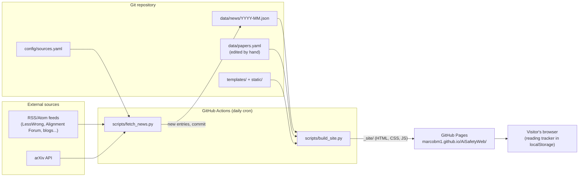

# How This Site Works

> These are my notes on the **current** state of the project. I update them in
> the same commit as every change. Sections marked **🚧 Not built yet** describe
> the design I agreed on for a future stage.
>
> I wrote them for someone with a technical background (my own is security
> operations) who is new to web development. Unfamiliar terms are defined in the
> [Glossary](#glossary).

**Current status:** Stage 1 of 7 complete (repository setup and initial documentation).

## Contents
1. [What this project is](#1-what-this-project-is)
2. [Architecture](#2-architecture)
3. [Folders and files](#3-folders-and-files)
4. [Setting up a computer](#4-setting-up-a-computer)
5. [The fetch script, step by step](#5-the-fetch-script-step-by-step)
6. [Building and previewing the site locally](#6-building-and-previewing-the-site-locally)
7. [GitHub Actions and the cron schedule](#7-github-actions-and-the-cron-schedule)
8. [Deployment to GitHub Pages and the base path](#8-deployment-to-github-pages-and-the-base-path)
9. [How to…](#9-how-to)
10. [Working from two computers](#10-working-from-two-computers)
11. [Common problems and fixes](#11-common-problems-and-fixes)
12. [Glossary](#glossary)

---

## 1. What this project is

I built a **static website** about AI Safety, hosted for free on **GitHub Pages**
at https://marcobm1.github.io/AiSafetyWeb/. It has:

| Section | What it shows | Where the data comes from |
|---|---|---|
| **Today in AI Safety** (home) | Entries from the last 24–48 h, grouped by topic/source | Collected automatically every day |
| **News archive** | All earlier entries, browsable by date, filterable by source/topic | Same automatic collection |
| **Papers** | My curated list of important papers, filterable by year/tag/difficulty | `data/papers.yaml`, which I edit by hand |
| **Reading tracker** | Each visitor marks papers as *read* / *to read* | The visitor's own browser (localStorage) |
| **About** | What the site is, sources, how updates work | Template text |

My content rules: the site only shows the **title, source, date, a short excerpt
(max ~2 sentences) and a link** to each original. I never republish full
articles. Each entry has an empty `summary` field that I'm reserving for future
AI summaries.

## 2. Architecture

There is **no server and no database**. Everything is files in the Git repository.
A robot (GitHub Actions) runs once a day, adds new data, rebuilds the HTML and
publishes it.



**Why I chose Python + Jinja2 instead of a site generator like Astro or Eleventy:**
the fetch script has to be Python anyway. Writing the page generator in Python
too means I only deal with one language and toolchain (no Node.js/npm), and
Python is also the language I use for ML. The generated HTML is complete on its
own, so the site works without JavaScript. JavaScript only adds filters, the
dark-mode toggle and the reading tracker.

## 3. Folders and files

| Path | Purpose | Status |
|---|---|---|
| `CLAUDE.md` | Permanent rules for Claude sessions working on this repo | ✅ |
| `README.md` | Short intro and quick start | ✅ |
| `requirements.txt` | Python dependencies with **pinned** (exact) versions | ✅ |
| `.python-version` | The Python version (3.12). GitHub Actions reads this file too | ✅ |
| `.gitignore` | Files Git must ignore (`.venv/`, `_site/`, caches) | ✅ |
| `.gitattributes` | Forces LF line endings in the repo (avoids Windows/Linux diffs) | ✅ |
| `docs/HOW_THIS_SITE_WORKS.md` | These notes | ✅ |
| `docs/DEVLOG.md` | My chronological log of every change and why | ✅ |
| `config/sources.yaml` | All news sources, arXiv query, karma thresholds, topic keywords | 🚧 Stage 2 |
| `config/site.yaml` | Site title, base path, retention settings | 🚧 Stage 3 |
| `scripts/fetch_news.py` | Downloads feeds + arXiv, deduplicates, saves JSON | 🚧 Stage 2 |
| `data/news/YYYY-MM.json` | Collected news, one file per month | 🚧 Stage 2 |
| `data/status.json` | Time of last run + status of each source | 🚧 Stage 2 |
| `scripts/build_site.py` | Turns templates + data into the `_site/` folder | 🚧 Stage 3 |
| `templates/` | Jinja2 HTML templates | 🚧 Stage 3 |
| `static/` | CSS and JavaScript | 🚧 Stages 3–5 |
| `data/papers.yaml` | Curated paper archive | 🚧 Stage 4 |
| `.github/workflows/update-and-deploy.yml` | Daily automation | 🚧 Stage 6 |
| `_site/` | Generated website. **Not committed**, rebuilt each time | 🚧 Stage 3 |
| `.venv/` | Python virtual environment. **Not committed**, one per computer | ✅ (local) |

**Why one JSON file per month:** the files stay small, the daily Git diffs stay
readable, and merge conflicts are rare because only the current month's file changes.

**How I write these docs:** every Markdown file meant for readers (`README.md`,
everything in `docs/`) is written in first person, as my own technical notes,
in English. `CLAUDE.md` is the exception: it holds instructions for Claude, and
this style rule is recorded there so every session follows it.

## 4. Setting up a computer

### 4.1 Tools
I install these once per computer (Windows, PowerShell):

```powershell
winget install --id Git.Git -e
winget install --id Python.Python.3.12 -e
winget install --id GitHub.cli -e
```

Then I close and reopen the terminal so the new commands are found, and check:
`git --version`, `py -3.12 --version`, `gh --version`.

### 4.2 Location: never inside OneDrive
I keep the project at **`C:\dev\AiSafetyWeb`**. OneDrive (and similar sync tools)
upload and rewrite files inside the hidden `.git/` folder while Git is using
them. That can corrupt the repository or create "conflicted copy" files. GitHub
is already the synchronisation mechanism between my computers.

### 4.3 Authenticate Git with GitHub
```powershell
gh auth login
```
I choose: **GitHub.com** → **HTTPS** → **Yes** (authenticate Git with my GitHub
credentials) → **Login with a web browser**. I copy the one-time code shown,
press Enter, paste the code in the browser and approve. I check it worked with
`gh auth status`.

### 4.4 Git identity: local vs global configuration
Every commit records an author name and email. Git reads these settings from
three levels, and the most specific one wins:

| Level | Command | Stored in | Applies to |
|---|---|---|---|
| system | `git config --system` | Git installation folder | All users of the computer |
| **global** | `git config --global` | `C:\Users\<me>\.gitconfig` | All my repositories |
| **local** | `git config --local` | `<repo>\.git\config` | **Only this repository** |

I use **local** settings for this project, so they don't affect my other
repositories (for example, work ones that need a different identity):

```powershell
cd C:\dev\AiSafetyWeb
git config --local user.name "Marco Barrera Martín"
git config --local user.email "87645460+Marcobm1@users.noreply.github.com"
git config --local --list      # check
```

The email is GitHub's private **noreply** address (GitHub → Settings → Emails).
The repository is public and every commit shows its author email, so this
address keeps my real email private. Local settings live inside `.git/`,
which is not pushed, so **I have to run these commands on each computer**.

### 4.5 Python virtual environment (venv)
A **virtual environment** is a private folder (`.venv/`) holding the Python
packages for this project only. It stops these packages from clashing with my
other Python projects. It is not committed; each computer creates its own from
`requirements.txt`.

```powershell
cd C:\dev\AiSafetyWeb
py -3.12 -m venv .venv                 # create (once per computer)
.\.venv\Scripts\Activate.ps1           # activate (every new terminal)
pip install -r requirements.txt        # install pinned packages
deactivate                             # leave the venv (optional)
```

When the venv is active, the prompt starts with `(.venv)` and `python` means the
project's Python 3.12.

If `Activate.ps1` is blocked with *"running scripts is disabled on this system"*,
I run this once: `Set-ExecutionPolicy -Scope CurrentUser RemoteSigned`. If a
company policy forbids it, I skip activation and call the venv's Python directly:
`.\.venv\Scripts\python.exe scripts\build_site.py`.

**Same Python everywhere:** `.python-version` says `3.12`. I create the local
venv with `py -3.12`, and the GitHub Actions workflow reads the same file.

## 5. The fetch script, step by step

🚧 **Not built yet (Stage 2).** The design I agreed on:

1. Read `config/sources.yaml` (I keep all sources in this one file).
2. For each RSS/Atom source: download the feed, apply filters (e.g. karma
   threshold: **30 for LessWrong, 20 for the Alignment Forum**). A failing
   source is logged as an error and **the others continue**.
3. Query the arXiv API for cs.AI, cs.LG and cs.CL, filtered by keywords
   (alignment, interpretability, reward hacking, AI safety, red teaming,
   evaluations…), with the pauses between requests that arXiv requires.
4. Normalise each entry to: `id` (hash of URL), `url`, `title`, `source`,
   `published`, `fetched_at`, `excerpt` (≤2 sentences, HTML stripped),
   `topics[]`, `summary` (null, reserved for future AI summaries).
5. Assign topics (alignment, interpretability, evals, governance, security)
   from keywords.
6. Remove duplicates by URL and merge into `data/news/YYYY-MM.json`.
7. Write `data/status.json` (run time + per-source result) **on every run**,
   even with no new entries. The daily commit this produces keeps the
   repository active.

## 6. Building and previewing the site locally

🚧 **Not built yet (Stage 3).** The command I plan to use, which builds the site
and starts a local server:

```powershell
python scripts\build_site.py --serve
```
Then I open the URL it prints (under `/AiSafetyWeb/`, like the real site).

## 7. GitHub Actions and the cron schedule

🚧 **Not built yet (Stage 6).** The design I agreed on: a **single** workflow
`update-and-deploy.yml`, triggered by a daily cron, by a manual button and by
every push to `main`. It fetches, commits the data, builds and deploys.

I use one workflow and not two because commits made by a workflow (with the
built-in `GITHUB_TOKEN`) **do not trigger other workflows**. A separate
"deploy on push" workflow would never see the robot's commits.

**60-day inactivity rule:** GitHub disables scheduled workflows in public
repositories after 60 days without repository activity. My safeguards:
- `data/status.json` is committed on every run, so there is activity every day.
- The site shows a visible warning if the last update is older than 48 hours.
  This check runs in the visitor's browser, so it still works if Actions stops.
- GitHub emails me when a workflow run fails.

## 8. Deployment to GitHub Pages and the base path

🚧 **Details in Stages 3 and 6.**

**The base path problem:** this is a *project site*, so it lives under a
sub-folder: `https://marcobm1.github.io/AiSafetyWeb/`. A link written as
`/css/style.css` would point to `https://marcobm1.github.io/css/style.css`,
which does not exist. Every internal link and asset must be prefixed with
`/AiSafetyWeb/`. I define the prefix **once** in `config/site.yaml`
(`base_path`) and all templates use it.

## 9. How to…

- **Add a news source:** 🚧 Stage 2 (edit `config/sources.yaml`).
- **Add a paper:** 🚧 Stage 4 (edit `data/papers.yaml`).
- **Change the design:** 🚧 Stage 5 (edit `static/css/style.css`).
- **Upgrade a Python package:** I activate the venv, run
  `pip install --upgrade <pkg>`, test the build, then `pip freeze > requirements.txt`,
  keep the explanatory comment at the top of the file, and commit.

## 10. Working from two computers

### Setting up my second computer
1. Install the tools and authenticate (sections 4.1 and 4.3).
2. Clone **outside OneDrive**:
   ```powershell
   New-Item -ItemType Directory -Force C:\dev
   git clone https://github.com/Marcobm1/AiSafetyWeb.git C:\dev\AiSafetyWeb
   cd C:\dev\AiSafetyWeb
   ```
3. Set the local Git identity (section 4.4). `git clone` does not copy it.
4. Create the venv and install packages (section 4.5).

### My routine, every time
```powershell
cd C:\dev\AiSafetyWeb
git pull                       # ALWAYS first
# ... work ...
git add -A
git commit -m "Describe the change in English"
git push                       # ALWAYS at the end
```

**Why `git pull` first is essential here:** the GitHub Action commits new data
**every day**. The remote will have new commits even if I haven't changed
anything. If I commit without pulling first, `git push` is rejected with
*"Updates were rejected because the remote contains work that you do not have
locally"*. I fix it with `git pull`, then `git push` again.

### Resolving a conflict
A conflict happens when the same lines of the same file changed both locally
and on GitHub. Here it would usually be in `data/`.

1. `git pull` reports `CONFLICT (content): Merge conflict in <file>`.
2. `git status` lists the conflicting files.
3. I open the file (VS Code highlights conflicts and offers *Accept Current /
   Incoming / Both*). The markers look like this:
   ```
   <<<<<<< HEAD
   my local version
   =======
   the version from GitHub
   >>>>>>> origin/main
   ```
   I edit the file so it contains the correct final content with no markers left.
4. `git add <file>` then `git commit` (Git proposes a merge message) and `git push`.

**Shortcut for data files:** `data/news/*.json` and `data/status.json` are
written by the robot, and I normally shouldn't edit them by hand. If they
conflict, I keep GitHub's version: `git checkout --theirs data/<file>` →
`git add data/<file>` → `git commit` → `git push`.

**Abort if unsure:** `git merge --abort` returns me to the state before the pull.

## 11. Common problems and fixes

| Symptom | Cause | Fix |
|---|---|---|
| `git`/`python`/`gh` "not recognized" right after installing | The terminal was opened before installation | Close and reopen the terminal (or VS Code) |
| `python` opens the Microsoft Store | Windows "app execution alias" | Use `py -3.12`, or activate the venv; or disable the alias in Settings → Apps → Advanced app settings → App execution aliases |
| `Activate.ps1 cannot be loaded… running scripts is disabled` | PowerShell execution policy | `Set-ExecutionPolicy -Scope CurrentUser RemoteSigned`, or use `.\.venv\Scripts\python.exe` directly |
| `git push` asks for a password / `Authentication failed` / 403 | Git is not authenticated | `gh auth login` (section 4.3) |
| `git push` rejected: "remote contains work…" | The daily Action pushed commits | `git pull`, then `git push` |
| Commits show the wrong author/email | Identity not set on this computer | `git config --local user.email ...` (section 4.4) |

## Glossary

- **API** — An interface through which a program requests data from a service (here the arXiv API returns paper listings as Atom/XML).
- **Atom** — A feed format similar to RSS.
- **Base path** — The sub-folder a site lives under (`/AiSafetyWeb/`). All internal links must include it.
- **Branch / `main`** — A line of development in Git. `main` is the default and the one that is published.
- **CI/CD** — *Continuous Integration / Continuous Deployment*: automatically building, testing and publishing on every change or schedule. GitHub Actions is my CI/CD here.
- **Clone** — Download a full copy of a repository, including its history.
- **Commit** — A saved snapshot of changes in Git, with a message and author.
- **Cron** — A syntax for schedules (`minute hour day month weekday`). `0 6 * * *` = every day at 06:00 UTC.
- **Deploy** — Publish a built version of the site so visitors can see it.
- **Feed** — A machine-readable list of a site's latest posts (RSS or Atom).
- **GitHub Actions** — GitHub's automation service. It runs *workflows* (YAML files) on GitHub's servers when triggered.
- **GitHub Pages** — GitHub's free hosting for static websites.
- **`GITHUB_TOKEN`** — A temporary credential that GitHub gives each workflow run so it can commit or deploy.
- **Jinja2** — A Python templating language: HTML files with placeholders like `{{ title }}` that a script fills with data.
- **JSON / YAML** — Text formats for structured data. JSON is strict and machine-friendly. YAML is more readable for hand-edited files.
- **Karma** — The community voting score of a LessWrong / Alignment Forum post. I use it as a noise filter.
- **localStorage** — A small key-value store inside the visitor's browser, per website. Private to that browser. It can be unavailable (private mode, blocked storage), which is why every access is wrapped in `try/catch`.
- **Merge conflict** — When Git cannot automatically combine two edits of the same lines.
- **Pinned version** — An exact package version (`==`) so every install is identical (reproducible builds).
- **Pull / Push** — Download new commits from GitHub / upload my commits to GitHub.
- **Remote / `origin`** — The copy of the repository on GitHub. `origin` is its conventional name.
- **Repository (repo)** — A project folder tracked by Git, including its full history.
- **RSS** — *Really Simple Syndication*: a standard XML format for publishing a list of recent posts.
- **Static site** — A website made of fixed files (HTML/CSS/JS) served as-is, with no server-side code or database. Fast, cheap (free here) and secure.
- **Static site generator** — A program that builds a static site from templates + data (mine is `scripts/build_site.py`).
- **Virtual environment (venv)** — A per-project folder with its own Python packages.
- **Workflow** — A YAML file in `.github/workflows/` that tells GitHub Actions what to run and when.
